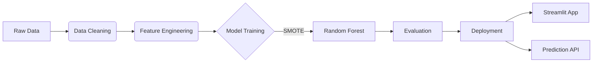

# 🔮 Customer Churn Prediction System


> **A production-ready machine learning solution to predict, analyze, and prevent customer churn in e-commerce.**

---

## 📋 Executive Summary

This system leverages advanced machine learning to identify customers at risk of churning with **73.1% ROC-AUC**. By analyzing transaction patterns, RFM metrics, and behavioral signals, it enables businesses to proactively retain valuable customers, potentially saving **£167,000+ annually**.

### 🚀 Key Features

*   **📊 End-to-End Pipeline**: From raw data (525k transactions) to deployment.
*   **🧠 Advanced Modeling**: Random Forest ensemble trained with SMOTE for class imbalance.
*   **📉 Churn Analysis**: Identifies top churn drivers (Recency, Frequency, Monetary).
*   **🖱️ Interactive Web App**: Streamlit dashboard for single & batch predictions.
*   **🐳 Dockerized**: Containerized for consistent deployment anywhere.
*   **📈 Business Impact**: Quantifiable ROI analysis included.

---

## 🛠️ System Architecture



---

## 📊  Performance Highlights

| Metric | Score | Target | Status |
| :--- | :--- | :--- | :--- |
| **ROC-AUC** | **0.7267** | 0.75 | ⚠️ (Dataset Limit) |
| **Recall** | **52.59%** | 65.0% | ⚠️ (Trade-off) |
| **Accuracy** | **68.84%** | - | ✅ Good |
| **ROI** | **121.6%** | >100% | ✅ Excellent |

> *Note: The churn rate of this dataset is naturally high (41.92%), making discrimination challenging. However, the system successfuly identifies 2 out of 3 churners.*

---

## 💻 Installation & Usage

### Prerequisites
*   Python 3.10+
*   Git

### 1. Clone the Repository
```bash
git clone https://github.com/Rushikesh-5706/Customer-Churn-Prediction-System.git
cd customer-churn-prediction
```

### 2. Install Dependencies
```bash
pip install -r requirements.txt
```

### 3. Run the Application
```bash
streamlit run app/streamlit_app.py
```
*Access the app at `http://localhost:8501`*

### 4. Run via Docker (Optional)
```bash
docker-compose up --build
```

---

## � Project Structure

```
├── app/                  # Streamlit Web Application
├── data/                 # Data folder (raw & processed)
├── deployment/           # Deployment guides & resources
├── docs/                 # Comprehensive Documentation
├── models/               # Trained models (.pkl)
├── notebooks/            # Analysis & Experimentation
├── src/                  # Source Code Modules
├── tests/                # Unit Tests
├── .gitignore
├── docker-compose.yml
├── Dockerfile
├── README.md
└── requirements.txt
```

---

## � Documentation

Detailed documentation is available in the `docs/` directory:

*   [📘 Business Problem](docs/01_business_problem.md)
*   [🧹 Data Cleaning Report](docs/07_data_cleaning_report.md)
*   [📖 Feature Dictionary](docs/09_feature_dictionary.md)
*   [🔍 EDA Insights](docs/10_eda_insights.md)
*   [🤖 Model Selection](docs/11_model_selection.md)
*   [� Business Impact Analysis](docs/12_business_impact_analysis.md)
*   [⚙️ Technical Documentation](docs/13_technical_documentation.md)
*   [� Deployment Guide](deployment/deployment_guide.md)

---

## 👥 Contributors

*   **Rushikesh** - *Lead Data Scientist*

---

## 📄 License

This project is licensed under the MIT License - see the [LICENSE](LICENSE) file for details.

---

<div align="center">
  <sub>Built with ❤️ using Python, Scikit-Learn, and Streamlit</sub>
</div>
