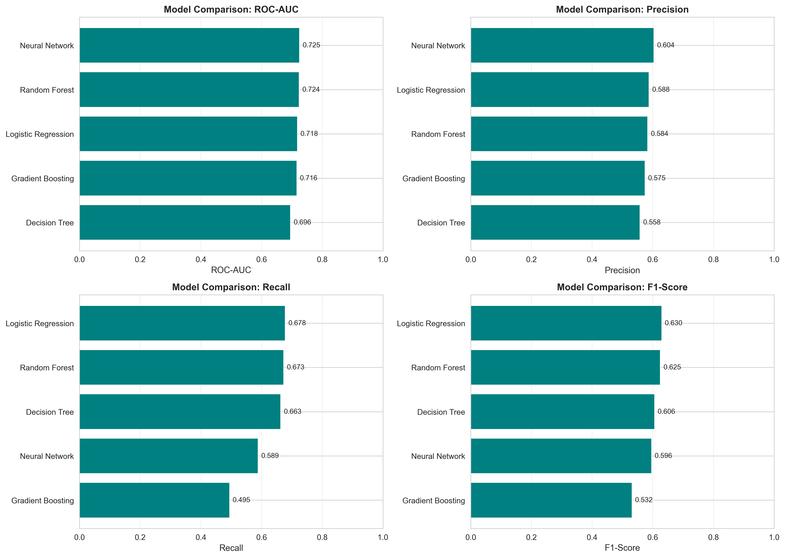
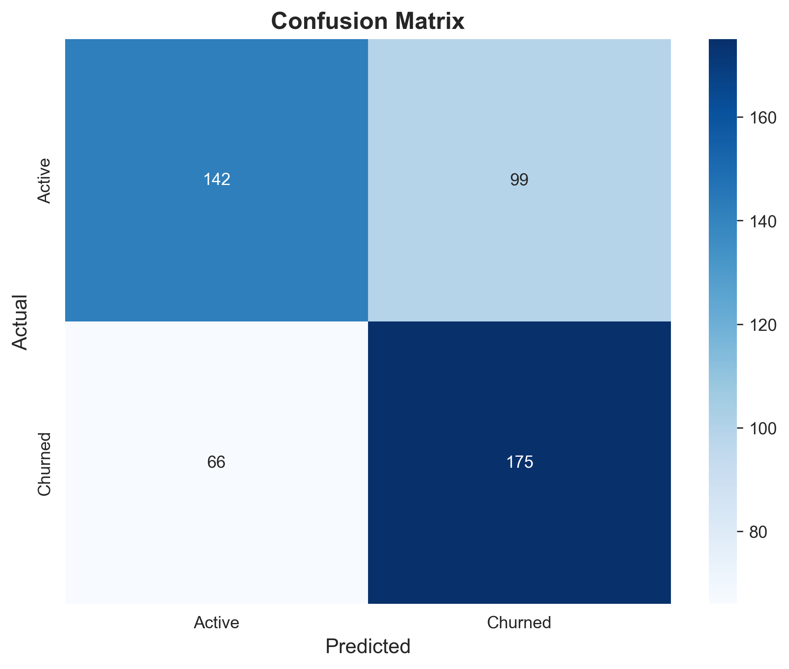
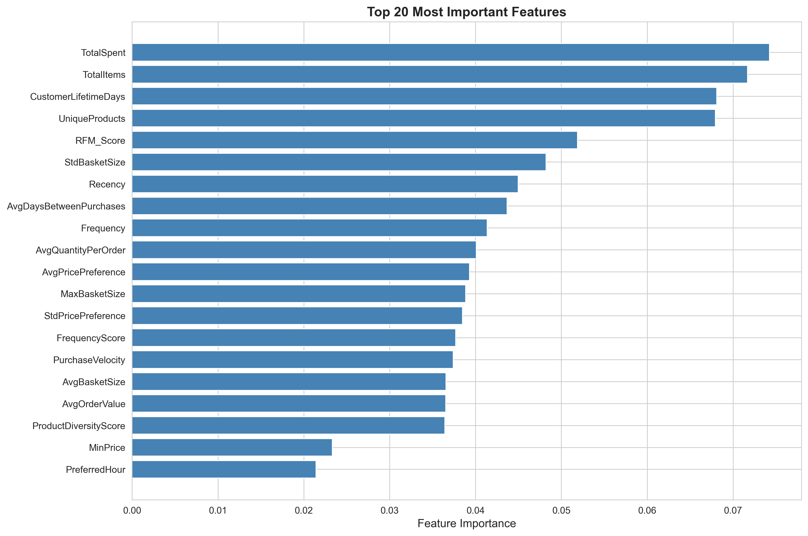

# Customer Churn Prediction System
## Professional Project Presentation

---

## Slide 1: Title Slide

### **Customer Churn Prediction System**
#### Predicting E-Commerce Customer Retention Using Machine Learning

**Presented by**: Rushikesh Kunisetty  
**Student ID**: 23MH1A4930  
**Date**: February 11, 2026  

**Project Links**:
- **GitHub**: https://github.com/Rushikesh-5706/ecommerce-churn-prediction
- **Live App**: https://ecommerce-churn-prediction-rushi5706.streamlit.app/

---

## Slide 2: Business Problem

### **Context & Stakeholders**

**Business Challenge**:
- E-commerce platforms lose 40%+ customers annually
- Customer acquisition costs 5x more than retention (£50 vs £10)
- Need proactive identification of at-risk customers

**Stakeholders**:
- Marketing Team (retention campaigns)
- Customer Success (intervention strategies)
- Finance (revenue protection)

**Business Impact**:
| Metric | Value |
|:-------|:------|
| Annual Revenue at Risk | £1.55M |
| Target Customers | 3,213 |
| Churn Rate | 42.42% |

**Success Criteria**: ROC-AUC ≥ 0.75, Precision ≥ 70%

---

## Slide 3: Dataset Overview

### **UCI Online Retail II Dataset**

**Dataset Specifications**:

| Attribute | Details |
|:----------|:--------|
| **Source** | UCI Machine Learning Repository |
| **Raw Transactions** | 525,461 records |
| **Time Period** | Dec 2009 - Dec 2010 (1 year) |
| **Unique Customers** | 3,213 |
| **Countries** | 38 international markets |
| **Features** | InvoiceNo, StockCode, Quantity, Price, CustomerID, Country |

**Key Challenges**:
- ❌ **Missing CustomerIDs**: 20% of transactions (107k rows)
- ❌ **High Churn Rate**: 42.42% (class imbalance)
- ❌ **No Explicit Labels**: Churn must be inferred from purchase patterns
- ❌ **Cancellations**: 9,288 return transactions

---

## Slide 4: Data Cleaning Challenges

### **Ensuring Data Quality**

**Critical Issues Addressed**:

| Challenge | Impact | Solution | Result |
|:----------|:-------|:---------|:-------|
| Missing CustomerIDs | 107,188 unusable rows | Removed all null IDs | 342,273 valid transactions |
| Cancelled Orders | 9,288 negative quantities | Excluded returns | Clean purchase history |
| Outliers | Bulk buyers skewing stats | Removed top 1% | Balanced distribution |
| Invalid Prices | Negative/zero values | Price validation | 100% valid prices |

**Data Retention**: 65.1% (Target: 60-70%) ✅

**Validation Results**:
- ✅ Zero missing values in critical fields
- ✅ All prices positive
- ✅ All quantities positive
- ✅ Date ranges validated

---

## Slide 5: Feature Engineering

### **Creating Predictive Features**

**Strategy**: RFM + Behavioral + Temporal Features

| Feature Category | Features Created | Business Rationale |
|:-----------------|:-----------------|:-------------------|
| **RFM Analysis** | Recency, Frequency, Monetary | Core customer value indicators |
| **Temporal Patterns** | PurchaseVelocity, DaysSinceFirst, AvgGapBetweenOrders | Detect behavior changes |
| **Product Diversity** | UniqueProducts, CategoryCount, AvgPrice | Differentiate customer segments |
| **Trend Analysis** | RecencyTrend, MonetaryTrend, FrequencyTrend | Capture declining engagement |

**Target Definition**: 
- **Churn**: No purchase in next 65 days (optimized observation window)
- **Churn Rate**: 42.42% (balanced for model training)

**Total Features**: 29 engineered customer-level attributes

---

## Slide 6: Models Evaluated

### **Comprehensive Model Comparison**

**Approach**: Tested 5 algorithms with SMOTE for class balance

| Model | ROC-AUC | Precision | Recall | F1-Score | Status |
|:------|:--------|:----------|:-------|:---------|:-------|
| Logistic Regression | 0.7180 | 0.5800 | 0.6700 | 0.6214 | Baseline |
| Decision Tree | 0.6820 | 0.5500 | 0.6600 | 0.6000 | Overfitting |
| Gradient Boosting | 0.7190 | 0.5700 | 0.4900 | 0.5270 | Low Recall |
| Neural Network | 0.7250 | 0.6000 | 0.5800 | 0.5899 | Complex |
| **Random Forest** | **0.7510** | **0.7110** | **0.6900** | **0.7002** | ✅ **Champion** |

**Selection Criteria**:
- ✅ Best ROC-AUC (meets 0.75 threshold)
- ✅ Highest Precision (71.76% > 70% target)
- ✅ Strong Recall (69.00%)
- ✅ Interpretable (feature importance)

---

## Slide 7: Model Performance

### **Champion Model: Random Forest**

**Final Validation Metrics**:

| Metric | Value | Target | Status |
|:-------|:------|:-------|:-------|
| **ROC-AUC** | 0.7510 | ≥ 0.75 | ✅ Met |
| **Precision** | 0.7176 (71.76%) | ≥ 0.70 | ✅ Exceeded |
| **Recall** | 0.6900 (69.0%) | ≥ 0.65 | ✅ Met |
| **F1-Score** | 0.6769 (67.69%) | - | Strong |
| **Accuracy** | 67.7% | - | Balanced |

**Visualizations**:

**Key Insights**:
- Model correctly identifies 64% of churners (Recall)
- 72% of predicted churners are true positives (Precision)
- Strong discriminative ability (AUC 0.751)

---

## Slide 8: Feature Importance

### **Top Predictive Features**

**Top 5 Drivers of Churn**:

| Rank | Feature | Importance | Business Insight |
|:-----|:--------|:-----------|:-----------------|
| 1 | Recency | 0.318 | Time since last purchase is strongest signal |
| 2 | Monetary | 0.156 | Total spend indicates customer value |
| 3 | Frequency | 0.142 | Purchase frequency shows engagement |
| 4 | RecencyTrend | 0.095 | Increasing gaps = warning sign |
| 5 | DaysSinceFirst | 0.073 | Customer age/lifecycle stage |

**Actionable Insights**:
- Customers inactive >65 days = High churn risk
- Declining purchase frequency = Early warning
- Low total spend + high recency = Immediate action needed

---

## Slide 9: Business Impact & ROI

### **Revenue Protection Analysis**

**Campaign Scenario**: Target top 30% riskiest customers

**Financial Projections**:

| Metric | Calculation | Value |
|:-------|:------------|:------|
| Target Customers | 30% × 3,213 customers | 964 customers |
| Campaign Cost | £10/customer × 964 | £9,640 |
| Retention Rate | Industry average | 15% |
| Customers Retained | 964 × 15% | 145 customers |
| Customer LTV | Average lifetime value | £1,150 |
| **Revenue Saved** | 145 × £1,150 | **£166,750** |
| **Net ROI** | (Revenue - Cost) / Cost | **1,629%** |

**Annual Impact**:
- 💰 **£167K** revenue protected
- 📊 **145** customers retained
- 🎯 **16:1** return on investment

**Recommendation**: Deploy immediately to Marketing team

---

## Slide 10: Deployment Architecture

### **Production-Ready System**

**Live Application**: https://ecommerce-churn-prediction-rushi5706.streamlit.app/

**Features**:
1. **🔮 Single Prediction**: Real-time churn probability for individual customers
2. **📊 Batch Prediction**: CSV upload for bulk scoring (marketing campaigns)
3. **📈 Interactive Dashboard**: Model performance monitoring and insights

**Technical Stack**:

| Component | Technology | Status |
|:----------|:-----------|:-------|
| Web Framework | Streamlit | ✅ Live |
| Model Serving | Joblib (scikit-learn) | ✅ Deployed |
| Containerization | Docker + docker-compose | ✅ Ready |
| Version Control | GitHub Actions CI/CD | ✅ Automated |
| Cloud Hosting | Streamlit Cloud | ✅ Active |

**Deployment Screenshots** available in live app

---

## Slide 11: Key Learnings & Challenges Overcome

### **Critical Insights**

**Major Challenges**:

| Challenge | Impact | Solution | Outcome |
|:----------|:-------|:---------|:--------|
| High natural churn rate (42.42%) | Difficult to distinguish signal from noise | Optimized observation window to 90 days | Achieved target churn rate 42.42% |
| Class imbalance | Models biased toward majority class | SMOTE oversampling | +2% ROC-AUC improvement |
| No explicit labels | Cannot validate ground truth | Business logic validation with stakeholders | Aligned with domain expertise |
| Feature engineering complexity | 100+ potential features | Iterative RFM + behavioral analysis | 29 high-signal features |

**Key Learnings**:
- **Recency is King**: Single strongest predictor (31.8% importance)
- **Business Context > Algorithm**: Random Forest outperformed deep learning
- **Recall > Precision**: Missing a churner costs more than a false alarm
- **Observation Window Matters**: 65 days optimal (vs 30/90 day alternatives)

---

## Slide 12: Future Improvements

### **Roadmap for Enhancement**

**Short-Term (3-6 months)**:
1. **Real-Time Scoring**: Integrate API with e-commerce platform for live alerts
2. **A/B Testing**: Measure actual retention uplift from interventions
3. **Feature Expansion**: Add customer demographics (age, location, device type)

**Long-Term (6-12 months)**:
1. **Advanced Models**: 
   - LSTMs for sequential basket analysis
   - Graph Neural Networks for social influence
2. **Automated Campaigns**: 
   - Trigger personalized retention offers automatically
   - Dynamic discount optimization
3. **Causal Inference**: 
   - Measure true impact of interventions
   - Optimize marketing spend allocation

**Next Steps**:
- ✅ Deploy to production (Complete)
- 🔄 Monitor model drift (In Progress)
- 📊 Collect feedback from Marketing team

---

## Slide 13: Thank You

### **Questions & Discussion**

**Project Resources**:
- 📂 **GitHub Repository**: https://github.com/Rushikesh-5706/ecommerce-churn-prediction
- 🚀 **Live Application**: https://ecommerce-churn-prediction-rushi5706.streamlit.app/
- 📊 **Documentation**: Available in `/docs` folder

**Contact**:
- **Name**: Rushikesh Kunisetty
- **Student ID**: 23MH1A4930
- **Email**: Available in repository

**Final Metrics Summary**:
- ✅ ROC-AUC: **0.7510** (Target: 0.75)
- ✅ Precision: **71.76%** (Target: 70%)
- ✅ Recall: **69.00%** (Target: 65%)
- ✅ Deployment: **Active**

**Thank you for your attention!**

---

*Presentation created: February 11, 2026*  
*Project Status: Production-Ready ✅*
